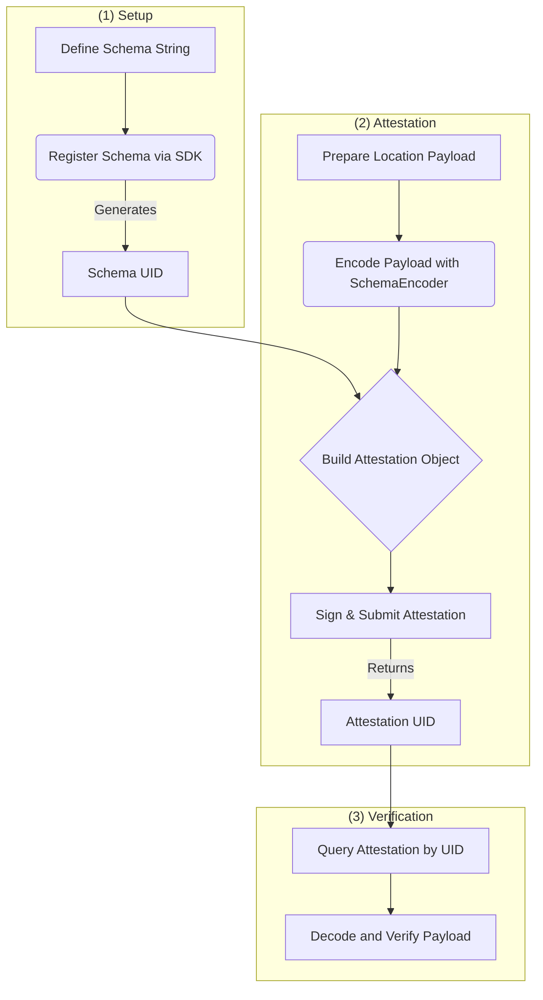

## Appendix: EAS Integration Reference

This guide provides a comprehensive reference for integrating the Location Protocol with the Ethereum Attestation Service (EAS). While the Location Protocol is an implementation-agnostic specification, EAS serves as the reference implementation for creating, managing, and verifying location attestations on EVM-compatible blockchains.

This appendix covers the end-to-end workflow, from setting up the development environment to deploying and verifying attestations in production.



### EAS Setup and Configuration

To interact with the Ethereum Attestation Service, developers can use the EAS SDK. It provides the necessary tools to connect to the EAS smart contracts, register schemas, and manage attestations.

**1. Installation**

First, install the EAS SDK and `ethers` (a required peer dependency) into your JavaScript or TypeScript project using npm or yarn.

```bash
npm install @ethereum-attestation-service/eas-sdk ethers
```

**2. SDK Initialization**

To use the SDK, you must instantiate the `EAS` class with the contract address for your target network and connect it to an Ethereum provider and signer. The signer is necessary for any transaction that writes to the blockchain, such as registering a schema or creating an attestation.

```typescript
import { EAS } from "@ethereum-attestation-service/eas-sdk";
import { ethers } from "ethers";

// Network-specific EAS contract address
// This is the Sepolia testnet address
const EAS_CONTRACT_ADDRESS = "0xC2679fBD37d54388Ce493F1DB75320D236e1815e";

// Initialize the EAS SDK
const eas = new EAS(EAS_CONTRACT_ADDRESS);

// Connect to a provider and signer
// Replace with your actual provider and signer setup
const provider = new ethers.JsonRpcProvider("YOUR_JSON_RPC_URL");
const signer = new ethers.Wallet("YOUR_PRIVATE_KEY", provider);
eas.connect(signer);
```

### Schema Registration

An EAS schema defines the structure and data types for an attestation. For the Location Protocol, a schema must contain the four base fields, though it can be extended with composable fields for more complex use cases.

**1. Define the Schema String**

A schema is defined as a comma-separated string of `type name` pairs. The base schema for the Location Protocol is:

```typescript
const schemaString =
  "string srs, string location_type, string location, uint8 lp_version";
```

**2. Register the Schema**

Schemas must be registered with the `SchemaRegistry` contract on the desired network. This action costs gas and creates a unique identifier (`schemaUID`) for the schema string. Once registered, a schema can be used by anyone to create attestations.

The following example demonstrates how to register a schema using the EAS SDK:

```typescript
import { SchemaRegistry } from "@ethereum-attestation-service/eas-sdk";

// Sepolia testnet Schema Registry contract address
const SCHEMA_REGISTRY_ADDRESS = "0x0a7E2Ff54e76B8E6659aedc9103FB21c038050D0";

const schemaRegistry = new SchemaRegistry(SCHEMA_REGISTRY_ADDRESS);
schemaRegistry.connect(signer); // Use the same signer as before

const schemaString =
  "string srs, string location_type, string location, uint8 lp_version";
const revocable = true; // Set to 'true' if attestations using this schema can be revoked

const transaction = await schemaRegistry.register({
  schema: schemaString,
  revocable,
});

// Wait for the transaction to be mined
const newSchemaUID = await transaction.wait();
console.log("New Schema UID:", newSchemaUID);
```

After registration, the `schemaUID` can be used to create attestations. You can view registered schemas on an explorer like EASSCAN. For example, the `schemaUID` for the base schema string above is `0xedd6b005e276227690314960c55a3dc6e088611a709b4fbb4d40c32980640b9a`.

### Attestation Creation

Creating an attestation involves preparing a data payload that matches a registered schema, encoding it, and submitting it to the EAS contract.

**1. Prepare and Encode the Location Payload**

The `SchemaEncoder` class is used to encode the structured payload data into a format that the EAS contract understands.

```typescript
import { SchemaEncoder } from "@ethereum-attestation-service/eas-sdk";

// 1. Define the data payload matching the schema
const locationPayload = [
  { name: "srs", value: "http://www.opengis.net/def/crs/OGC/1.3/CRS84", type: "string" },
  { name: "location_type", value: "coordinate-decimal+lon-lat", type: "string" },
  { name: "location", value: "-103.771556, 44.967243", type: "string" },
  { name: "lp_version", value: 1, type: "uint8" },
];

// 2. Initialize the SchemaEncoder with the schema string
const schemaEncoder = new SchemaEncoder(
  "string srs, string location_type, string location, uint8 lp_version"
);

// 3. Encode the data
const encodedData = schemaEncoder.encodeData(locationPayload);
```

**2. Submit the Attestation**

With the encoded data and the `schemaUID`, you can create the attestation object and submit it using the `eas.attest` method. This creates an on-chain record and returns a unique `attestationUID` for the new attestation.

```typescript
// The UID for the registered schema
const schemaUID =
  "0xedd6b005e276227690314960c55a3dc6e088611a709b4fbb4d40c32980640b9a";

const tx = await eas.attest({
  schema: schemaUID,
  data: {
    recipient: "0xFD50b031E778fAb33DfD2Fc3Ca66a1EeF0652165", // The recipient of the attestation
    expirationTime: 0, // 0 for no expiration
    revocable: true, // Must match the schema's revocable status
    data: encodedData,
  },
});

const newAttestationUID = await tx.wait();

console.log("New Attestation UID:", newAttestationUID);
```

### Attestation Verification

Attestations can be verified either on-chain using resolver contracts or off-chain using the EAS SDK. Off-chain verification is common for applications that do not require immediate on-chain logic.

**1. Querying an Attestation**

To verify an attestation, first retrieve it from the EAS contract using its `attestationUID`.

```typescript
const attestationUID = "YOUR_ATTESTATION_UID"; // The UID from the creation step

const attestation = await eas.getAttestation(attestationUID);

console.log(attestation);
```

The returned object contains all properties of the attestation, including the `attester`, `schemaUID`, `recipient`, and the encoded `data` payload.

**2. Verifying the Payload**

After fetching the attestation, you can decode the `data` field to verify its contents. This involves ensuring the attestation uses the correct schema, was created by a trusted attester, and that the payload data is valid.

```typescript
// Assuming 'attestation' is the object fetched in the previous step
// and 'schemaEncoder' is initialized with the correct schema string.

const decodedData = schemaEncoder.decodeData(attestation.data);

console.log("Decoded Data:", decodedData);
// Further validation logic can be applied to the decoded data.
```

### Deployment and Best Practices

When moving to production, consider the following factors to ensure security, efficiency, and reliability.

**Network Selection**
EAS is deployed on multiple networks. For development and testing, use a testnet like Sepolia. For production, choose a mainnet such as Ethereum, Base, Optimism, or Arbitrum based on your application's cost and performance requirements.

**Gas Considerations**
On-chain transactions, including schema registration and attestation, require gas fees. Gas costs are influenced by network congestion and the size of the transaction data. For attestations with large payloads, the cost can be significant.

**Handling Large Payloads with IPFS**
To manage costs for large data payloads, such as high-resolution images or videos associated with a location, it is recommended to store the data on a decentralized storage network like IPFS. The Location Protocol's `media_data` field can store the IPFS Content Identifier (CID) of the file, keeping the on-chain payload small and cost-effective.

**Security Best Practices**

- **Key Management**: The private key used for signing attestations is a critical asset. Use secure key management solutions like hardware wallets or services like Safe to protect the attester's identity.
- **Schema Version Pinning**: Always use a specific, trusted `schemaUID` in your application. Do not dynamically generate it from a schema string, as this could expose your application to a malicious schema registered with the same string but different properties (e.g., a different resolver).
- **Input Validation**: Sanitize all data used to create payloads to prevent injection attacks or malformed attestations.

**Troubleshooting Common Errors**

- **Invalid SchemaUID**: Ensure the `schemaUID` exists on the target network and corresponds to the schema string you are using for encoding.
- **Transaction Reverted**: This can happen due to insufficient gas, an incorrect signer, or mismatched data (e.g., trying to create a non-revocable attestation with a revocable schema). Check the transaction details on a block explorer for more information.
- **Encoding/Decoding Mismatch**: Verify that the data types and field names in your payload object exactly match the schema string used by the `SchemaEncoder`. Any discrepancy will lead to errors.

---

[:material-arrow-left: Back to Appendices Overview](index.md){ .md-button .md-button--primary }
