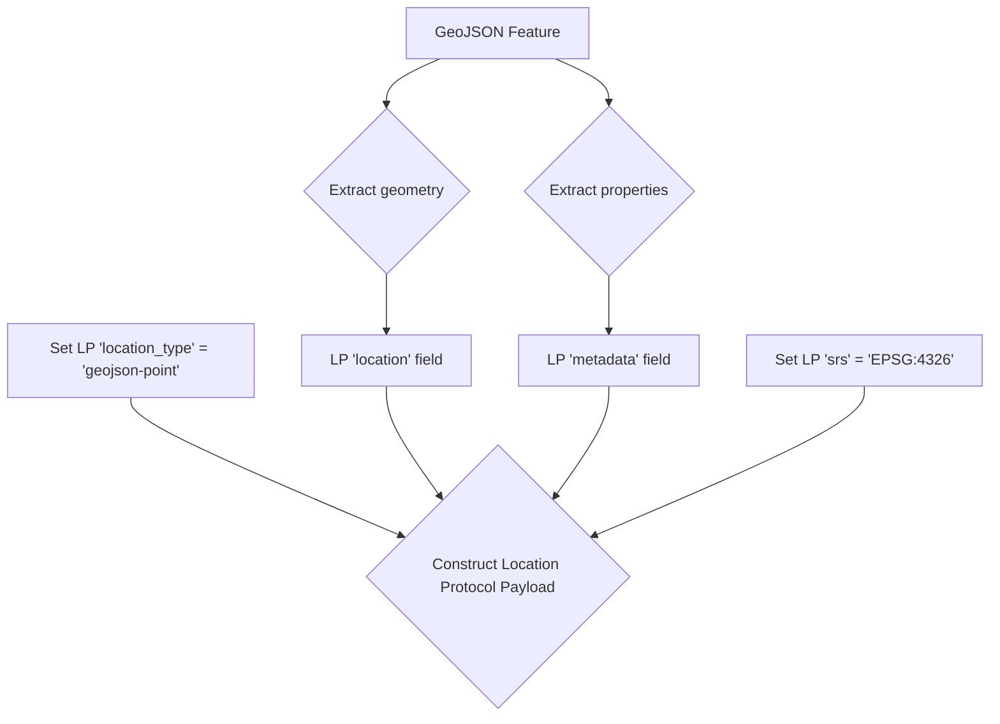

## GeoJSON Alignment and Interoperability

The Location Protocol is designed for interoperability with established geospatial standards to ensure broad adoption and seamless integration into existing workflows. This document outlines how the protocol aligns with GeoJSON (RFC 7946) and leverages Spatial Reference System (SRS) identifiers like EPSG codes, providing clear guidance for developers working across both conventional and decentralized ecosystems. The protocol encapsulates standard formats, adding a layer of cryptographic verifiability without replacing the underlying data structures that developers already use.

### Standards Mapping

While the Location Protocol is a container for location information, its fields map logically to concepts within the GeoJSON standard. The primary goal is to carry GeoJSON data as a verifiable payload.

The table below illustrates the direct mapping between Location Protocol's core fields and their GeoJSON counterparts when `location_type` is set to `geojson-point`.

| Location Protocol Field | GeoJSON Equivalent | Description                                                                                                                                                                 |
| :---------------------- | :----------------- | :-------------------------------------------------------------------------------------------------------------------------------------------------------------------------- |
| `location_type`          | N/A                | A Location Protocol field that specifies the format of the `location` data. For a GeoJSON Point Object, this would be set to `geojson-point`.                                                    |
| `location`              | `geometry`         | The `location` field directly holds a standard GeoJSON `Geometry` object (e.g., Point, LineString, Polygon).                                                                |
| `srs`                   | `crs` (deprecated) | Specifies the Spatial Reference System. For GeoJSON, this MUST be `EPSG:4326` to comply with RFC 7946, which mandates WGS 84.                                               |
| `composable-fields`     | `properties`       | Optional fields in the Location Protocol payload can be used to store the contents of the GeoJSON `properties` object, preserving all metadata associated with the feature. |

### Migration Guidance: GeoJSON to Location Protocol

Converting an existing GeoJSON `Feature` object into a Location Protocol payload is a straightforward process. This allows developers to wrap standard geospatial data in a verifiable, attestable format.

1. **Start with a GeoJSON Feature**: Begin with a standard GeoJSON `Feature` object, which contains `geometry` and `properties`.
2. **Initialize Location Protocol Payload**: Create a new Location Protocol payload structure.
3. **Set `location_type`**: Set the `location_type` field to `"geojson-point"` to indicate the format of the location data.
4. **Assign Geometry**: Copy the entire `geometry` object from the GeoJSON `Feature` into the `location` field of the protocol payload.
5. **Assign Properties**: Copy the `properties` object from the GeoJSON `Feature` into a suitable composable field, such as `metadata`, within the Location Protocol payload.
6. **Set Spatial Reference System (`srs`)**: Set the `srs` field to `"EPSG:4326"`. According to RFC 7946, GeoJSON coordinates are always in the World Geodetic System 1984 (WGS 84), and `EPSG:4326` is the corresponding identifier.

#### Example Conversion

This example demonstrates the transformation of a GeoJSON `Feature` into a Location Protocol payload.

**1. Original GeoJSON `Feature`**

```json
{
  "type": "Feature",
  "geometry": {
    "type": "Point",
    "coordinates": [-74.0445, 40.6892]
  },
  "properties": {
    "name": "Statue of Liberty",
    "type": "National Monument"
  }
}
```

**2. Resulting Location Protocol Payload**

```json
{
  "lp_version": "1.0",
  "srs": "EPSG:4326",
  "location_type": "geojson-point",
  "location": {
    "type": "Point",
    "coordinates": [-74.0445, 40.6892]
  },
  "metadata": {
    "name": "Statue of Liberty",
    "type": "National Monument"
  },
  "event_timestamp": "2025-06-25T23:36:00Z"
}
```

#### Conversion Flow

The following diagram illustrates the migration workflow.



### Interoperability Matrix

The Location Protocol's features are designed to map clearly onto capabilities defined in major geospatial standards.

| Location Protocol Feature                | GeoJSON (RFC 7946) | EPSG         |
| :--------------------------------------- | :----------------- | :----------- |
| **Base Fields** (`srs`, `location_type`)  | Partial Support    | Full Support |
| **Location Types** (`geojson-point`, etc.)     | Full Support       | N/A          |
| **Composable Fields** (`metadata`, etc.) | Full Support       | N/A          |

- **GeoJSON**: Fully supports encapsulating `geometry` and `properties` objects. The `crs` member was removed from the GeoJSON spec, but the Location Protocol's `srs` field provides explicit support for coordinate system definition.
- **EPSG**: Fully supported via the `srs` field to define the coordinate reference system for any `location_type`, ensuring unambiguous spatial context.

### Compatibility and Best Practices

When integrating the Location Protocol with systems that consume GeoJSON, adhere to the following notes to ensure compatibility.

- **Coordinate Order**: GeoJSON mandates a coordinate order of **longitude, latitude** for geographic coordinates. Payloads must conform to this order when `location_type` is a geojson based object.
- **Protocol as a Wrapper**: Remember that a Location Protocol payload is a _wrapper_ for geospatial data, not a replacement for it. The payload adds context, versioning, and verifiability around a standard data format like GeoJSON.

> **Note:** When specifying the SRS for GeoJSON alignment, always use a full URI (e.g., `http://www.opengis.net/def/crs/OGC/1.3/CRS84`). Shorthand codes like "EPSG:4326" are deprecated. See [Deprecation of legacy shorthand codes](srs.md#deprecation-of-legacy-shorthand-codes).

[:material-arrow-left: Back to Appendices Overview](index.md){ .md-button .md-button--primary }
