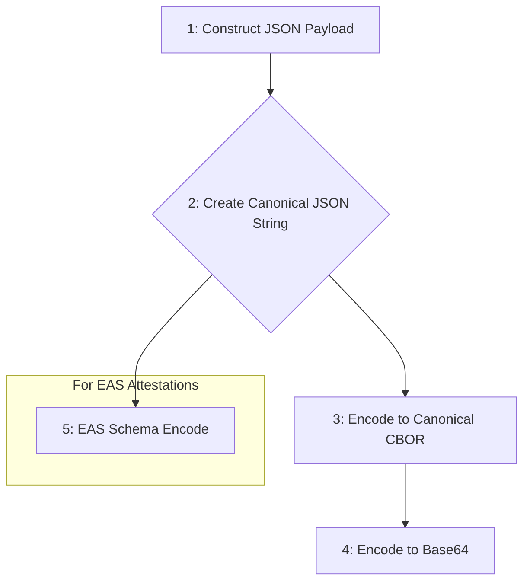

To ensure consistent and interoperable implementations, Location Protocol payloads must be encoded and serialized according to strict, deterministic rules. This guide provides the technical requirements for encoding, serialization, and verification, enabling developers to produce byte-for-byte identical outputs for any given payload.

### Serialization Requirements

Deterministic serialization is critical for ensuring that a payload's hash and signature can be independently and reliably verified. All implementations must adhere to the following rules to produce a canonical binary representation.

**Field Ordering**
To guarantee a consistent structure, all keys in a JSON object must be sorted lexicographically (alphabetically) before serialization. This applies to the top-level payload object and any nested objects within it.

**Deterministic Encoding**
The goal of serialization is to produce an identical binary output from any implementation given the same logical input. Common sources of non-determinism must be eliminated:

- **JSON Formatting**: Before encoding, the JSON payload should be represented as a compact string with no insignificant whitespace (e.g., newlines or extra spaces between keys, values, and separators).
- **String and Number Purity**: String values must not contain leading or trailing whitespace. Numeric values should use a standard representation without leading zeros (e.g., `0.5` not `0.50` or `.5`).

**Payload Size Constraints**
The Location Protocol does not define a mandatory maximum payload size. However, developers should consider the constraints of the target environment:

- **Resource-Constrained Devices**: For IoT or embedded devices, smaller payloads (e.g., under 2 KB) are recommended to minimize memory and processing overhead.
- **On-Chain Applications**: When payloads are used in blockchain attestations (e.g., with EAS), size directly impacts transaction costs. For large data like media files, it is best practice to store the data off-chain (e.g., on IPFS) and include only the Content Identifier (CID) in the payload.

### Encoding Procedures

The encoding process transforms the logical JSON payload into a verifiable, transport-safe format. This is achieved through a multi-step pipeline.



1. **Construct JSON Payload**: Create the Location Payload as a standard JSON object according to the protocol's data model specification.
2. **Create Canonical JSON String**: Convert the JSON object into a compact, canonical string. This involves sorting all keys alphabetically at every level and removing all insignificant whitespace.
3. **Encode to Canonical CBOR**: Encode the canonical JSON string into a binary format using the Concise Binary Object Representation (CBOR), as specified in [RFC 7049](https://www.rfc-editor.org/rfc/rfc7049). Implementations must use the Canonical CBOR format to ensure a single, valid encoding for any given data item. CBOR is used for its compact size and efficient processing.
4. **Encode to Base64**: The resulting binary CBOR data is then encoded into a Base64 string using the standard variant defined in [RFC 4648](https://www.rfc-editor.org/rfc/rfc4648). This step ensures the binary data can be safely transmitted within text-based formats like JSON or URLs.
5. **EAS Schema Encoding**: When creating an on-chain attestation with the Ethereum Attestation Service (EAS), the payload data must be further encoded to match the registered EAS schema. The EAS SDK's `SchemaEncoder` packs the payload fields according to their defined types (e.g., `string`, `bytes32`, `uint256`), producing a final `bytes` object for the attestation's `data` field.

### Verification Procedures

Payload integrity and authenticity are verified using cryptographic hashing and digital signatures. This process allows any third party to confirm that a payload has not been tampered with and originated from the claimed attester.

**Payload Hashing**
A cryptographic hash serves as a unique and fixed-size fingerprint of the payload.

- **Procedure**: The hash is generated from the canonical CBOR binary data (result of Step 3 in the encoding process).
- **Algorithm**: Implementations should use a secure hash algorithm such as SHA-256, following [NIST best practices](https://csrc.nist.gov/projects/hash-functions).

> **Pseudocode: Hashing** > `payload_hash = SHA256(canonical_cbor_payload)`

**Digital Signatures**
A digital signature provides proof of origin and integrity. It binds the identity of the signer to a specific payload hash.

- **Signature Generation**: The signer uses their private key to sign the payload hash (not the full payload). This is a standard, efficient practice.
- **Verification**: A verifier can use the signer's public key to confirm that the signature corresponds to the hash of the received payload.

1. The verifier independently re-calculates the payload hash from the received payload using the specified serialization and hashing rules.
2. The verifier uses the signer's public key to decrypt the signature, revealing the original hash.
3. If the re-calculated hash matches the hash from the signature, the payload is considered authentic and its integrity is verified.

### Code Snippets and Examples

This example illustrates the end-to-end encoding and hashing process using a GeoJSON location.

**1. Initial JSON Payload**

```json
{
  "lp_version": "1.0.0",
  "srs": "http://www.opengis.net/def/crs/OGC/1.3/CRS84",
  "location_type": "geojson-point",
  "location": {
    "type": "Point",
    "coordinates": [-103.771556, 44.967243]
  },
  "event_timestamp": "2025-06-25T23:18:00Z"
}
```

**2. Canonical JSON String (Keys sorted, no whitespace)**

```json
{
  "event_timestamp": "2025-06-25T23:18:00Z",
  "location": { "coordinates": [-103.771556, 44.967243], "type": "Point" },
  "location_type": "geojson-point",
  "lp_version": "1.0.0",
  "srs": "http://www.opengis.net/def/crs/OGC/1.3/CRS84"
}
```

**3. Canonical CBOR Representation (as hex)**

```
a563737273782c687474703a2f2f7777772e6f70656e6769732e6e65742f6465662f6372732f4f47432f312e332f4352533834686c6f636174696f6ea2647479706565506f696e746b636f6f7264696e6174657382fbc059f1612c6ac216fb40467bce9e5e24796a6c705f76657273696f6e65312e302e306d6c6f636174696f6e5f747970656d67656f6a736f6e2d706f696e746f6576656e745f74696d657374616d7074323032352d30362d32355432333a31383a30305a
```

**4. Base64-Encoded CBOR**

```
pWNzcnN4LGh0dHA6Ly93d3cub3Blbmdpcy5uZXQvZGVmL2Nycy9PR0MvMS4zL0NSUzg0aGxvY2F0aW9uomR0eXBlZVBvaW50a2Nvb3JkaW5hdGVzgvvAWfFhLGrCFvtARnvOnl4keWpscF92ZXJzaW9uZTEuMC4wbWxvY2F0aW9uX3R5cGVtZ2VvanNvbi1wb2ludG9ldmVudF90aW1lc3RhbXB0MjAyNS0wNi0yNVQyMzoxODowMFo=
```

**5. Hashed Payload (SHA-256 of CBOR bytes)**

```
6d1c84f5ca7a3e794ca661e60c272753bce9587b1a6202cd3427135200240af9
```

### Extensibility and Custom Fields

The protocol is designed to be extensible with custom fields. The serialization rules ensure forward compatibility.

- **Handling Custom Fields**: Any additional fields, whether standard extensions or user-defined, must be included in the alphabetical key sorting process during canonicalization.
- **Interoperability**: Implementations that do not recognize a custom field can still correctly serialize and verify the payload, as the rules apply universally. To promote wider adoption, new fields should be proposed and documented via the official extensibility framework.

---

[:material-arrow-left: Back to Implementation Overview](index.md){ .md-button .md-button--primary }
