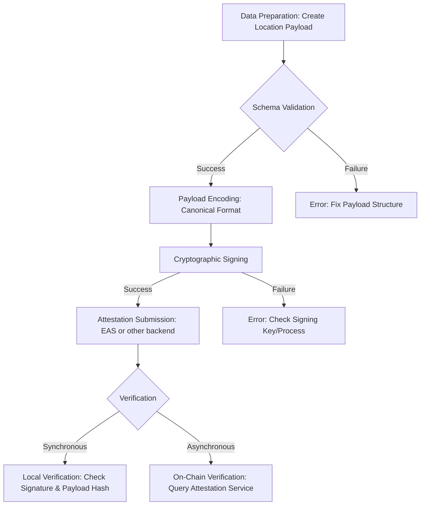

This guide provides a step-by-step workflow for integrating the Location Protocol into applications. It covers the entire lifecycle, from preparing location data to creating and verifying on-chain attestations, using the Ethereum Attestation Service (EAS) as a reference implementation .

## Implementation Workflow

The end-to-end process involves preparing a standards-compliant data payload, encoding and signing it, submitting it as an attestation, and finally, verifying its integrity .

### Workflow Diagram

The following diagram illustrates the complete attestation lifecycle, including local (synchronous) and on-chain (asynchronous) verification paths .

### Workflow Steps

Follow these procedures to create and verify a location attestation .

**1. Data Preparation**
First, construct a Location Payload object containing the data you wish to attest to. This payload must include the required base fields (`specVersion`, `srs`, `locationType`, `location`) and any optional composable fields (`eventTimestamp`, `mediaData`, etc.) relevant to your use case .

- **Action**: Create a JSON object that conforms to the Location Protocol's data model.
- **Reference**: See the [Base Data Model](specification/data-model.md) and [Composable Fields](specification/composable-fields.md) documentation for field definitions .

**2. Schema Validation**
Before proceeding, validate your payload against the official Location Protocol JSON Schema. This step ensures structural and data type correctness, preventing downstream errors .

- **Action**: Use a standard JSON Schema validator (e.g., AJV) to check the payload against the published schema .
- **Error Handling**: If validation fails, review the error messages to correct missing fields, data type mismatches, or incorrect enum values.

**3. Payload Encoding**
To ensure deterministic output for signing and verification, the payload must be canonically encoded. The recommended format is CBOR (Concise Binary Object Representation), followed by Base64 encoding for transport .

- **Action**: Serialize the validated JSON payload into a canonical CBOR byte array.
- **EAS SDK Example**: The EAS SchemaEncoder handles this process by defining the schema structure and encoding the data values accordingly .
- **Reference**: Adhere to specifications like RFC 7049 (CBOR) for deterministic encoding .

**4. Cryptographic Signing**
The attester signs the hash of the encoded payload with their private key. This signature proves the authenticity and integrity of the data, linking it to the attester's address .

- **Action**: Generate a hash (e.g., Keccak-256) of the canonically encoded payload. Sign this hash using the attester's private key.
- **EAS SDK Example**: The `eas.signTypedData` method simplifies this process by constructing the EIP-712 typed data structure and prompting a wallet to sign it .

**5. Attestation Submission**
Submit the encoded payload and its signature to an attestation service. Using EAS, this is done by calling the `attest` function on the EAS smart contract .

- **Asynchronous Flow**: The transaction is submitted to the blockchain. Confirmation requires waiting for the transaction to be mined and finalized, which can take time depending on network conditions .
- **Off-Chain Storage**: For large payloads, store the data on a decentralized storage network like IPFS and include the resulting Content Identifier (CID) in the on-chain attestation data. This minimizes on-chain data costs .
- **Network Configuration**: Ensure your application is configured for the correct network (e.g., Sepolia for testing, Ethereum Mainnet for production) and has sufficient funds to cover gas fees .

**6. Verification**
Verification confirms the authenticity and integrity of a location attestation. This can be done locally for immediate checks or by querying the blockchain for the highest level of trust .

- **Synchronous (Local) Verification**:

1. Decode the attestation data.
2. Re-hash the original payload using the same canonical method.
3. Use the attester's public key (address) and the signature to verify that the signed hash matches the re-computed hash. This provides instant verification without needing a network call .

- **Asynchronous (On-Chain) Verification**:

1. Query the attestation service (e.g., EAS contract) using the attestation's unique ID (UID).
2. Confirm that the attestation exists on-chain, is not revoked, and was made by the expected attester address .

### Troubleshooting Guide

Refer to this guide for common failure modes and their resolutions .

| Failure Mode                       | Common Cause(s)                                                                                                                 | Resolution Steps                                                                                                                                                                                                                                                                     |
| :--------------------------------- | :------------------------------------------------------------------------------------------------------------------------------ | :----------------------------------------------------------------------------------------------------------------------------------------------------------------------------------------------------------------------------------------------------------------------------------- |
| **Schema Validation Failure**      | Missing required fields, incorrect data types, or invalid enum values.                                                          | 1. Compare the payload structure against the official [JSON Schema](specification/schemas.md).   2. Ensure all required fields (`specVersion`, `srs`, `locationType`, `location`) are present.   3. Verify that data types (e.g., string, number) match the schema definition. |
| **Encoding Mismatch**              | Non-deterministic JSON serialization (e.g., inconsistent key order) before encoding. Using an incorrect encoding library.       | 1. Use a canonical CBOR or JSON library that guarantees deterministic output.   2. Ensure field ordering is consistent during payload creation.                                                                                                                                   |
| **Signature Verification Failure** | The data signed does not exactly match the data being verified. The wrong private key was used.                                 | 1. Ensure the exact same canonical encoding process is used for both signing and verification.   2. Verify the signer's address corresponds to the private key used to create the signature.                                                                                      |
| **EAS Transaction Reverted**       | Insufficient gas, incorrect schema UID, invalid recipient address, or attesting to a non-existent schema on the target network. | 1. Increase the gas limit for the transaction.   2. Verify the Schema UID is correct for the network you are using (e.g., Sepolia vs. Mainnet).   3. Ensure the schema is registered in the EAS Schema Registry on the correct network before attesting .                      |
| **Off-Chain Data Not Found**       | The CID in the attestation points to data that is no longer available or was never pinned on IPFS.                              | 1. Ensure that off-chain data is successfully uploaded and pinned to a reliable IPFS pinning service.   2. Verify the CID is correct and accessible via a public IPFS gateway.                                                                                                    |

### Implementation Checklist

Use this checklist to ensure your integration is complete and ready for production .

- [ ] **Data Preparation**: Payloads are correctly structured with all required base fields.
- [ ] **Schema Validation**: A validation step is included to check all payloads against the official JSON Schema before processing.
- [ ] **Canonical Encoding**: Payloads are encoded deterministically (e.g., using canonical CBOR) before signing.
- [ ] **Signing**: Attestations are signed with the correct private key, and signatures are generated from the hash of the encoded payload.
- [ ] **Attestation Service**: The integration correctly targets the desired attestation service (EAS or other) on the appropriate network.
- [ ] **Error Handling**: The application gracefully handles potential errors like schema violations, signature failures, and network transaction reversions.
- [ ] **Verification Logic**: Both local (synchronous) and on-chain (asynchronous) verification mechanisms are implemented as needed.
- [ ] **Off-Chain Storage**: If used, the IPFS integration includes robust pinning and CID management.
- [ ] **Network Configuration**: The application can be easily configured for different networks (e.g., testnets, mainnet) .
- [ ] **Security**: Private keys are managed securely, and all inputs are sanitized.

---

[:material-arrow-left: Back to Implementation Overview](index.md){ .md-button .md-button--primary }
