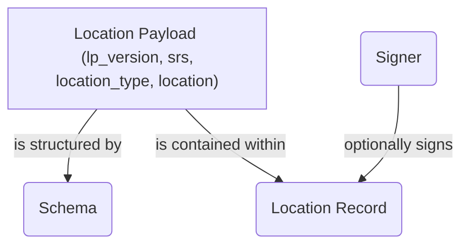
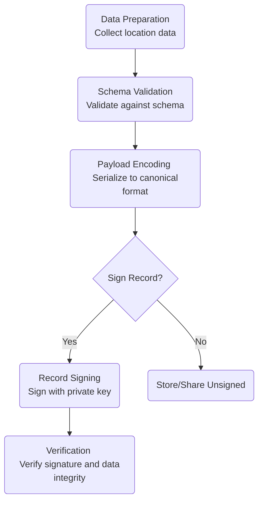

## Core Concepts

This document establishes the fundamental concepts, terminology, and architecture of the Location Protocol. It provides the essential vocabulary and conceptual framework for understanding and implementing the protocol, serving as a foundation for the entire specification.

### Core Terminology

The following terms are used consistently throughout the specification. Precise definitions are critical for correct implementation.

**Location Protocol**: A standardized framework and set of rules for creating, sharing, and verifying location information in a decentralized and cryptographically secure manner. It is a specification, not a single piece of software, designed to be implementation-agnostic.

**Location Payload**: The core data structure containing the location information itself, along with essential metadata. It includes required base fields that ensure the data is unambiguous and parsable.

The primary fields include:

- `lp_version`: The version of the Location Protocol specification the payload adheres to (e.g., `"1.0.0"`).
- `srs`: The Spatial Reference System URI (e.g., `http://www.opengis.net/def/crs/OGC/1.3/CRS84`) that defines the coordinate system.
- `location_type`: An identifier for the format of the `location` data (e.g., `coordinate-decimal`, `geojson-point`).
- `location`: The geospatial data itself, formatted according to `location_type`.

```json
{
  "lp_version": "1.0.0",
  "srs": "http://www.opengis.net/def/crs/OGC/1.3/CRS84",
  "location_type": "coordinate-decimal",
  "location": [-103.771556, 44.967243]
}
```

**Location Record**: A structured, portable representation of location data that can optionally be cryptographically signed for verification. When signed, a Location Record becomes a verifiable claim (often called a "Location Attestation") that provides evidence an event occurred at a specific place and time. The protocol is designed to support both signed and unsigned records, enabling use across centralized, decentralized, and hybrid systems.

**Schema**: Defines the structure, data types, and validation rules for a Location Payload. Schemas are essential for ensuring data consistency and integrity across different implementations. Systems like the Ethereum Attestation Service (EAS) use schemas to register and validate the structure of records before they are stored.

**Proof Types**: Refers to the different methods and evidence used to generate and support a Location Record. The protocol is extensible to support a variety of proof mechanisms, which can be specified in the payload's optional proof fields (`stamp_type` and `stamps`). These can range from simple assertions to complex, multi-source verifications.

Examples of conceptual proof categories include:

- **Sensor Data**: Evidence from device sensors like GPS, Wi-Fi, or magnetometers.
- **Network**: Triangulation and signed confirmations from distributed network nodes.
- **Social**: Confirmations or challenges from peers attesting to a location.
- **Authority-based**: Verification from a trusted entity, such as an event organizer or government official.

### System Architecture and Data Flow

The protocol's architecture separates the data payload from the attestation, enabling a flexible and modular system.

#### **Conceptual Architecture**

The core components interact to create a verifiable location record. The `Location Payload` is the data, the `Schema` is its blueprint, and the `Location Record` can optionally be cryptographically signed for verification.



#### **Data Record Flow**

Creating a valid Location Record follows a clear, sequential process, ensuring that data is well-formed and optionally signed before being shared or verified.



### Protocol vs. Implementation

It is crucial to distinguish between the protocol specification and its various implementations.

- The **Location Protocol** is the set of rules and data formats described in this specification. It defines _what_ a valid Location Payload and Record are.
- An **implementation** is a specific software system that uses the protocol. For example, the Ethereum Attestation Service (EAS) can serve as an on-chain backend for creating, storing, and resolving signed Location Records, while ATProto provides another implementation pattern for the decentralized social web. The protocol is designed to be implementation-agnostic.

### Spatial Reference Systems (SRS)

A Spatial Reference System (SRS), also known as a Coordinate Reference System (CRS), is a framework used to precisely define locations on Earth's surface (or other celestial bodies). Every Location Payload must include an `srs` URI. The protocol follows OGC standards, using URIs like `http://www.opengis.net/def/crs/OGC/1.3/CRS84` (for WGS 84 with longitude/latitude order) or `http://www.opengis.net/def/crs/EPSG/0/4326` (for WGS 84 with latitude/longitude order). This field is mandatory to prevent ambiguity about coordinate systems and axis order, ensuring that coordinate values are interpreted correctly by any application consuming the data.

### Extensibility Framework

The Location Protocol is designed for extensibility to support evolving use cases and technologies. The framework allows for the registration and use of new identifiers for core components, enabling community-driven expansion without altering the base specification.

Key extension points include:

- **Location Types**: New `location_type` identifiers can be proposed to support different geospatial data formats beyond the core set (e.g., `h3-index`, `wkt-polygon`, `geohash`).
- **Proof Types**: The `stamp_type` field allows for new proof mechanisms to be defined, enabling different strategies for location verification.
- **Composable Fields**: Optional fields can be added to payloads to support use cases like attaching media, structured attributes, timestamps, or other contextual data.

---

[:material-arrow-left: Back to Introduction Overview](index.md){ .md-button .md-button--primary }
