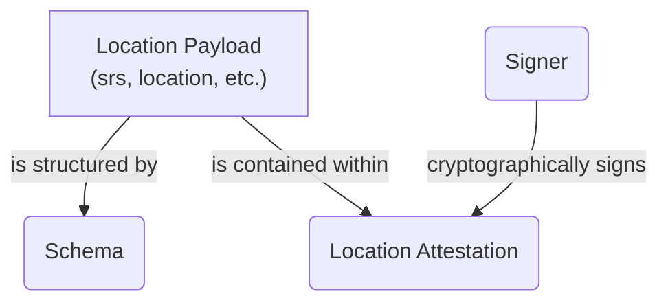
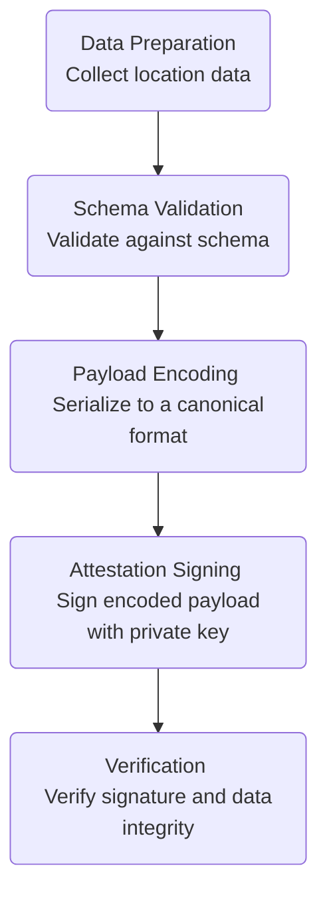

## Core Concepts

This document establishes the fundamental concepts, terminology, and architecture of the Location Protocol. It provides the essential vocabulary and conceptual framework for understanding and implementing the protocol, serving as a foundation for the entire specification.

### Core Terminology

The following terms are used consistently throughout the specification. Precise definitions are critical for correct implementation.

**Location Protocol**: A standardized framework and set of rules for creating, sharing, and verifying location information in a decentralized and cryptographically secure manner. It is a specification, not a single piece of software, designed to be implementation-agnostic.

**Location Payload**: The core data structure containing the location information itself, along with essential metadata. It includes required base fields that ensure the data is unambiguous and parsable.

The primary fields include:

- `srs`: The Spatial Reference System identifier (e.g., `EPSG:4326`) that defines the coordinate system.
- `locationType`: An identifier for the format of the `location` data (e.g., `coordinate-decimal`, `geojson`).
- `location`: The geospatial data itself, formatted according to `locationType`.
- `specVersion`: The version of the Location Protocol specification the payload adheres to.

```json
{
  "srs": "EPSG:4326",
  "locationType": "coordinate-decimal/lon-lat",
  "location": [-103.771556, 44.967243],
  "specVersion": "1.0"
}
```

**Location Attestation**: A cryptographically signed, verifiable claim containing a Location Payload. It serves as a "Proof-of-Location," providing verifiable evidence that an event occurred at a specific place and time. The attestation ensures the integrity and authenticity of the location data, linking it to a specific signer.

**Schema**: Defines the structure, data types, and validation rules for a Location Payload. Schemas are essential for ensuring data consistency and integrity across different implementations. Systems like the Ethereum Attestation Service (EAS) use schemas to register and validate the structure of attestations before they are recorded.

**Proof Types**: Refers to the different methods and evidence used to generate and support a Location Attestation. The protocol is extensible to support a variety of proof mechanisms, which can be specified in the payload's optional proof fields (`recipeType` and `recipePayload`). These can range from simple assertions to complex, multi-source verifications.

Examples of conceptual proof categories include:

- **Sensor Data**: Evidence from device sensors like GPS, Wi-Fi, or magnetometers.
- **Network**: Triangulation and signed confirmations from distributed network nodes.
- **Social**: Confirmations or challenges from peers attesting to a location.
- **Authority-based**: Verification from a trusted entity, such as an event organizer or government official.

### System Architecture and Data Flow

The protocol's architecture separates the data payload from the attestation, enabling a flexible and modular system.

#### **Conceptual Architecture**

The core components interact to create a verifiable location claim. The `Location Payload` is the data, the `Schema` is its blueprint, and the `Location Attestation` is the signed, verifiable wrapper around that data.



#### **Data Attestation Flow**

Creating a valid Location Attestation follows a clear, sequential process, ensuring that data is well-formed and securely signed before being shared or verified.



### Protocol vs. Implementation

It is crucial to distinguish between the protocol specification and its various implementations.

- The **Location Protocol** is the set of rules and data formats described in this specification. It defines _what_ a valid Location Payload and Attestation are.
- An **implementation** is a specific software system that uses the protocol. For example, the Ethereum Attestation Service (EAS) can serve as an on-chain backend for creating, storing, and resolving Location Attestations, but it is only one of many possible implementations.

### Spatial Reference Systems (SRS)

A Spatial Reference System (SRS), also known as a Coordinate Reference System (CRS), is a framework used to precisely define locations on Earth's surface. Every Location Payload must include an `srs` identifier, such as `EPSG:4326`, which is the standard for GPS coordinates (WGS 84). This field is mandatory to prevent ambiguity and ensure that coordinate values are interpreted correctly by any application consuming the data.

### Extensibility Framework

The Location Protocol is designed for extensibility to support evolving use cases and technologies. The framework allows for the registration and use of new identifiers for core components, enabling community-driven expansion without altering the base specification.

Key extension points include:

- **Location Types**: New `locationType` identifiers can be proposed to support different geospatial data formats beyond the core set (e.g., `h3`, `wkt`).
- **Proof Types**: The `recipeType` field allows for new proof mechanisms to be defined, enabling different strategies for location verification.
- **Composable Fields**: Optional fields can be added to payloads to support use cases like attaching media or other contextual data.

---

[:material-arrow-left: Back to Introduction Overview](index.md){ .md-button .md-button--primary }
