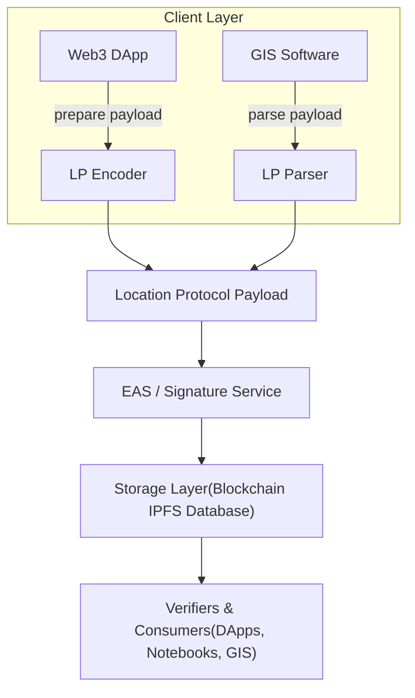

## Protocol Overview

The Location Protocol provides a standardized framework for creating, sharing, and verifying spatial information across diverse digital systems. It is designed to make structured, signed spatial data as easy to exchange as JSON, bridging traditional geospatial practices with the principles of the decentralized web.

The protocol's core artifact is the **Location Protocol (LP) Payload**, a self-contained, digitally signed unit of spatial data. Each record functions like a portable and cryptographically verifiable entry in a geospatial database. These records can serve two main purposes:

- **Descriptive Records**: Simply describe a place, boundary, or asset with geographic data.
- **Claim-based Records**: Make a verifiable assertion, such as "I was at this location at this specific time".

All records are signed to guarantee their integrity and authorship. When necessary, a record can be enhanced with **Location Proofs**—additional cryptographic evidence or sensor data that allows others to assess the accuracy and trustworthiness of a claim. This structure enables both people and automated systems to evaluate what a record asserts, who authored it, whether it has been tampered with, and ultimately, whether it should be believed.

### Guiding Principles

The philosophy of the Location Protocol is rooted in the vision for a decentralized geospatial web, emphasizing three core principles: Open, Durable, and Opt-in.

| Principle   | Description                                                                                                                                                                                                                                                        |
| :---------- | :----------------------------------------------------------------------------------------------------------------------------------------------------------------------------------------------------------------------------------------------------------------- |
| **Open**    | The protocol is public-domain, royalty-free, and extends existing geospatial standards like EPSG and GeoJSON. This ensures any system—from a GIS desktop application to a smart contract or a metaverse engine—can implement it without permission.                |
| **Durable** | Records carry cryptographic guarantees. Hashes ensure data integrity, digital signatures provide non-repudiation, and versioning ensures long-term interoperability. Records can be stored on permanent ledgers like blockchains or other durable storage systems. |
| **Opt-in**  | Location records, or attestations, are user-controlled. Users have full authority over what information to disclose, when, and to whom. This enables privacy-preserving patterns like selective disclosure and provenance chaining.                                |

### High-Level Goals

The Location Protocol is an open specification designed to be implementation-agnostic; any system that adheres to the structural rules can produce fully interoperable records. While a reference implementation exists using the Ethereum Attestation Service (EAS), the protocol does not depend on any specific blockchain or storage layer.

The primary goals are to:

- **Establish Location as a First-Class Primitive**: Treat spatial information as a fundamental data type within the decentralized web.
- **Bridge Worlds**: Merge established geospatial standards with the architectural advantages of Web3, such as user control, immutability, and tamper-evidence.
- **Foster Trustworthy Exchange**: Enable diverse applications to interoperate, evaluate claims, and exchange reliable spatial information.
- **Support Extensibility**: Provide a minimal, flexible foundation that supports an expandable range of feature types, data formats, and location proofs.

By achieving these goals, the protocol helps build a more open, transparent, and resilient ecosystem for geospatial data on the web.

## High-Level Architecture

The following diagram illustrates the core components and data flow of the Location Protocol:

- **Client Layer**: Developers use SDKs or libraries to encode/decode LP payloads within Web3 or GIS applications.
- **LP Encoder/Parser**: Enforces schema compliance and serializes to canonical CBOR.
- **EAS/Signature Service**: Signs payloads on-chain or off-chain, attaching metadata (author, timestamp, schema UID).
- **Storage Layer**: Stores attestations in blockchains, IPFS, or traditional databases for durability and accessibility.
- **Verifiers & Consumers**: Any system can fetch, verify signatures, and interpret spatial data for downstream use.

---

[:material-arrow-left: Back to Introduction Overview](index.md){ .md-button .md-button--primary }
