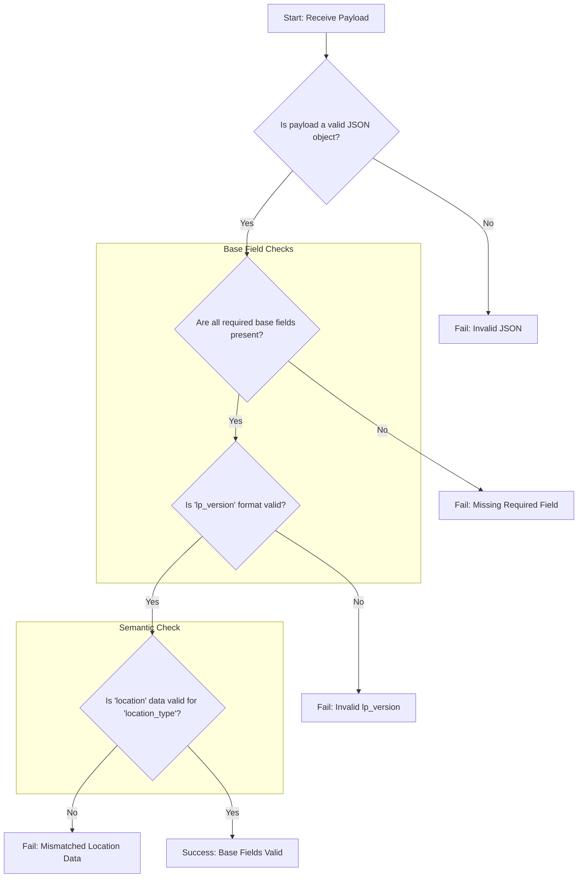

## Base Data Model Specification

Every Location Protocol payload must be a JSON object containing a set of required base fields that provide essential context for interpreting the location data. These fields ensure that any compliant system can correctly parse and understand the payload's structure, coordinate system, and specification version.

### Field Definitions and Constraints

The base data model consists of four required fields: `lp_version`, `srs`, `location_type`, and `location`. Implementations must ensure these fields are present and valid in every Location Protocol payload.

**`lp_version`**

- **Description**: A string that identifies the version of the Location Protocol specification to which the payload conforms. This ensures parsers can apply the correct rules for validation and interpretation. The field name uses snake_case and is namespaced with `lp_` to avoid conflicts when Location Protocol payloads are embedded within other specifications (e.g., STAC Items).
- **Type**: `string`
- **Constraints**:
  - This field is **required**.
  - The value MUST follow semantic versioning with the pattern `major.minor.patch` (e.g., "1.0.0").

**`srs`**

- **Description**: A URI specifying the Spatial Reference System (SRS) used for the coordinate values within the `location` field. Using a resolvable, machine-readable URI is critical for unambiguous spatial interpretation and interoperability.
- **Type**: `string`
- **Constraints**:
  - This field is **required**.
  - The value MUST be a valid HTTP URI or URN.
  - The value SHOULD use the OGC URI format: `http://www.opengis.net/def/crs/{authority}/{version}/{code}`
    -  `http://www.opengis.net/def/crs/EPSG/0/4326` for WGS 84 with latitude/longitude order.
    -  `http://www.opengis.net/def/crs/OGC/1.3/CRS84` for WGS 84 with longitude/latitude order.

!!! note
    Short codes like "EPSG:4326" are deprecated in favor of full URIs. More details on the deprecation can be found in the **Spatial Reference Systems** appendix resources page: [Deprecation of legacy shorthand codes](../appendices/srs.md#deprecation-of-legacy-shorthand-codes).

**`location_type`**

- **Description**: A string that defines the format of the data contained in the `location` field. This acts as a schema identifier, informing the consumer how to parse the `location` data.
- **Type**: `string`
- **Constraints**:
  - This field is **required**.
  - The value MUST correspond to an identifier in the official Location Type Registry (e.g., `geojson-point`, `h3`, `coordinate-decimal+lon-lat`).

**`location`**

- **Description**: The field containing the core spatial data. The structure of this field is determined by the value of `location_type`.
- **Type**: `string | number[] | object`
- **Constraints**:
  - This field is **required**.
  - The data structure MUST be valid according to the format specified by `location_type`. For example, if `location_type` is `geojson`, this field must contain a valid GeoJSON Geometry Object as defined in RFC 7946.

### Schema Definitions

The formal structure of the base data model is defined below in both JSON formats.

**JSON Schema**
This schema can be used for programmatic validation of Location Protocol payloads.

```json
{
  "$schema": "http://json-schema.org/draft-07/schema#",
  "title": "Location Protocol Base Payload",
  "description": "The base structure for a Location Protocol payload.",
  "type": "object",
  "properties": {
    "lp_version": {
      "description": "The specification version (e.g., '1.0.0').",
      "type": "string",
      "pattern": "^\\d+\\.\\d+\\.\\d+$"
    },
    "srs": {
      "description": "The Spatial Reference System URI (e.g., 'http://www.opengis.net/def/crs/EPSG/0/4326').",
      "type": "string",
      "format": "uri"
    },
    "location_type": {
      "description": "The format of the 'location' field, from the Location Type Registry.",
      "type": "string"
    },
    "location": {
      "description": "The spatial data, whose structure is defined by 'location_type'."
    }
  },
  "required": ["lp_version", "srs", "location_type", "location"]
}
```

### Validation Rules and Flow

Validation is a sequential process. An implementation must check for the presence and syntactic validity of all required base fields before proceeding to semantic validation (i.e., checking if the `location` data matches the `location_type`).

**Validation Checks**

- The payload MUST be a valid JSON object.
- The `lp_version` field MUST be present and its value MUST match the `major.minor.patch` semantic versioning pattern.
- The `srs` field MUST be present and contain a valid URI.
- The `location_type` field MUST be present and contain a non-empty string.
- The `location` field MUST be present.
- The value of the `location` field MUST validate against the schema defined for the given `location_type`.

**Validation Flowchart**
The following diagram illustrates the validation sequence for the base fields.



### Payload Examples

**Valid Payload**
This example shows a correctly formatted payload using the `geojson-point` location type.

```json
{
  "lp_version": "1.0.0",
  "srs": "http://www.opengis.net/def/crs/OGC/1.3/CRS84",
  "location_type": "geojson-point",
  "location": {
    "type": "Point",
    "coordinates": [-103.771556, 44.967243]
  }
}
```

**Invalid Payloads**
These examples demonstrate common validation errors.

```json
// Invalid: Missing the required 'srs' field.
{
  "lp_version": "1.0.0",
  "location_type": "geojson-point",
  "location": {
    "type": "Point",
    "coordinates": [-103.771556, 44.967243]
  }
}
```

```json
// Invalid: 'lp_version' does not match the required pattern.
{
  "lp_version": "v1",
  "srs": "http://www.opengis.net/def/crs/OGC/1.3/CRS84",
  "location_type": "geojson-point",
  "location": {
    "type": "Point",
    "coordinates": [-103.771556, 44.967243]
  }
}
```

```json
// Invalid: 'location' data (an array) does not match the 'geojson-point' location_type (expects an object).
{
  "lp_version": "1.0.0",
  "srs": "http://www.opengis.net/def/crs/OGC/1.3/CRS84",
  "location_type": "geojson-point",
  "location": [-103.771556, 44.967243]
}
```

---

[:material-arrow-left: Back to Specification Overview](index.md){ .md-button .md-button--primary }
